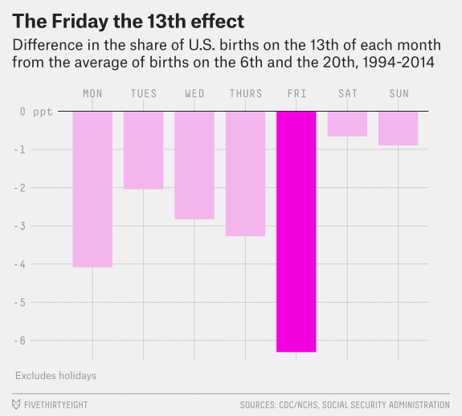

<!-- This file by Charlotte Wickham is licensed under a Creative Commons Attribution 4.0 International License. -->

```{r setup}
library(fivethirtyeight)
library(tidyverse)
```

## Task

Reproduce this figure from fivethirtyeight's article [*Some People Are Too Superstitious To Have A Baby On Friday The 13th*](https://fivethirtyeight.com/features/some-people-are-too-superstitious-to-have-a-baby-on-friday-the-13th/):



## Data

In the `fivethiryeight` package there are two datasets containing birth data, but for now let's just work with one, `US_births_1994_2003`.  Note that since we have data from 1994-2003, our results may differ somewhat from the figure based on 1994-2014.

## Your Turn 1 

With your neighbour, brainstorm the steps needed to get the data in a form ready to make the plot.

```{r}
US_births_1994_2003
```

## Some overviews of the data

Whole time series:
```{r}
ggplot(US_births_1994_2003, aes(x = date, y = births)) +
  geom_line()
```
There is so much fluctuation it's really hard to see what is going on.

Let's try just looking at one year:
```{r}
US_births_1994_2003 %>%
  filter(year == 1994) %>%
  ggplot(mapping = aes(x = date, y = births)) +
    geom_line()
```
Strong weekly pattern accounts for most variation.

## Strategy

Use the figure as a guide for what the data should like to make the final plot.  We want to end up with something like:

---------------------------
 day_of_week   avg_diff_13 
------------- -------------
     Mon         -2.686    

    Tues         -1.378    

     Wed         -3.274    
     
     ...          ...
     
---------------------------     

There is more than one way to get there, but we
ll roughly follow this strategy:

* Get just the data for the 6th, 13th, and 20th
* Calculate variable of interest:
    * (For each month/year):
        * Find average births on 6th and 20th
        * Find percentage difference between births on 13th and average births on 6th and 20th
    
    * Average percent difference by day of the week
* Create plot

## Your Turn 2

Extract just the 6th, 13th and 20th of each month:

```{r}
US_births_1994_2003 %>%
  select(-date) 

```

## Your Turn 3

Which arrangement is tidy?

**Option 1:**

-----------------------------------------------------
 year   month   date_of_month   day_of_week   births 
------ ------- --------------- ------------- --------
 1994     1           6            Thurs      11406  

 1994     1          13            Thurs      11212  

 1994     1          20            Thurs      11682  
-----------------------------------------------------

**Option 2:**

----------------------------------------------------
 year   month   day_of_week     6      13      20   
------ ------- ------------- ------- ------- -------
 1994     1        Thurs      11406   11212   11682 
----------------------------------------------------

(**Hint:** think about our next step *"Find the percent difference between the 13th and the average of the 6th and 12th"*. In which layout will this be easier using our tidy tools?)

## Your Turn 4

Tidy the filtered data to have the days in columns.

```{r}
US_births_1994_2003 %>%
  select(-date) %>% 
  filter(date_of_month %in% c(6, 13, 20))
```

## Your Turn 5

Now use `mutate()` to add columns for:

* The average of the births on the 6th and 20th
* The percentage difference between the number of births on the 13th and the average of the 6th and 20th

```{r}
US_births_1994_2003 %>%
  select(-date) %>% 
  filter(date_of_month %in% c(6, 13, 20)) %>%
  spread(date_of_month, births) 
```

## A little additional exploring

Now we have a percent difference between the 13th and the 6th and 20th of each month, it's probably worth exploring a little (at the very least to check our calculations seem reasonable).

To make it a little easier let's assign our current data to a variable
```{r}
births_diff_13 <- US_births_1994_2003 %>%
  select(-date) %>% 
  filter(date_of_month %in% c(6, 13, 20)) %>%
  spread(date_of_month, births) %>%
  mutate(
    avg_6_20 = (`6` + `20`)/2,
    diff_13 = (`13` - avg_6_20) / avg_6_20 * 100
  )
```

Then take a look
```{r}
births_diff_13 %>% 
  ggplot(mapping = aes(day_of_week, diff_13)) +
    geom_point()
```

Looks like we are on the right path.  There's a big outlier one Monday
```{r}
births_diff_13 %>%
  filter(day_of_week == "Mon", diff_13 > 10)
```

Seem's to be driven but a particularly low number of births on the 6th of Sep 1999. Maybe a holiday effect? Labour Day was of the 6th of Sep that year.

## Your Turn 6

Summarize each day of the week to have mean of diff_13.

Then, recreate the fivethirtyeight plot.

```{r}
US_births_1994_2003 %>%
  select(-date) %>% 
  filter(date_of_month %in% c(6, 13, 20)) %>%
  spread(date_of_month, births) %>%
  mutate(
    avg_6_20 = (`6` + `20`)/2,
    diff_13 = (`13` - avg_6_20) / avg_6_20 * 100
  ) 
```

## Extra Challenges

* If you wanted to use the `US_births_2000_2014` data instead, what would you need to change in the pipeline?  How about using both `US_births_1994_2003` and `US_births_2000_2014`?

* Try not removing the `date` column. At what point in the pipeline does it cause problems? Why?

* Can you come up with an alternative way to investigate the Friday the 13th effect?  Try it out!

## Takeaways

The power of the tidyverse comes from being able to easily combine functions that do simple things well.  

