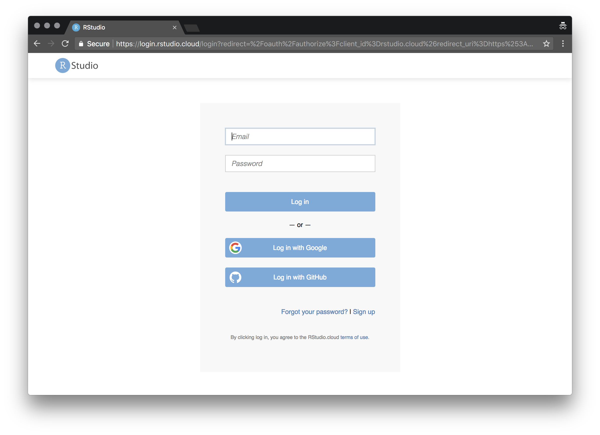
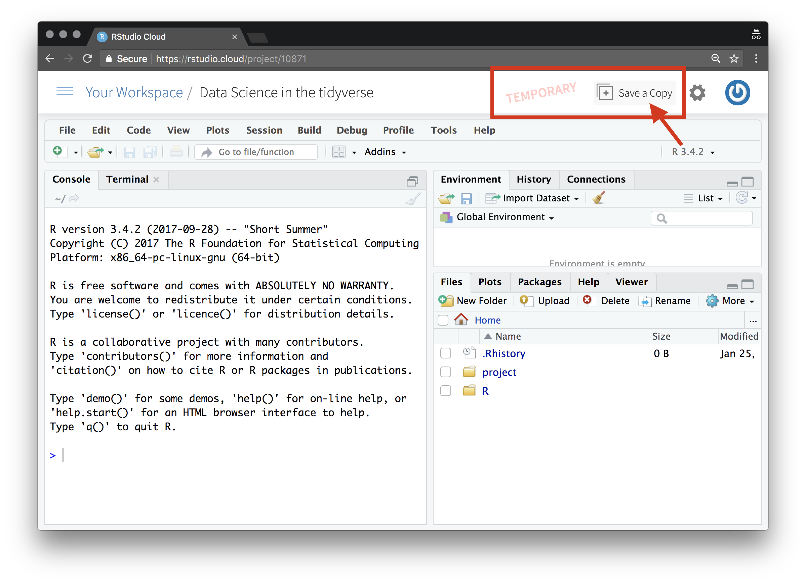
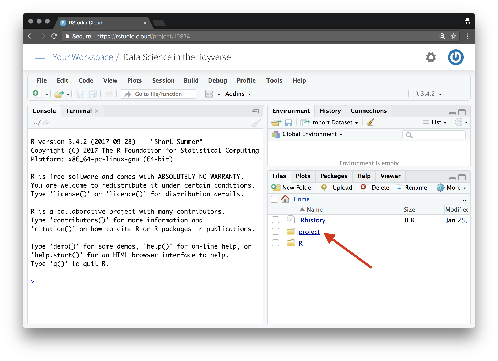
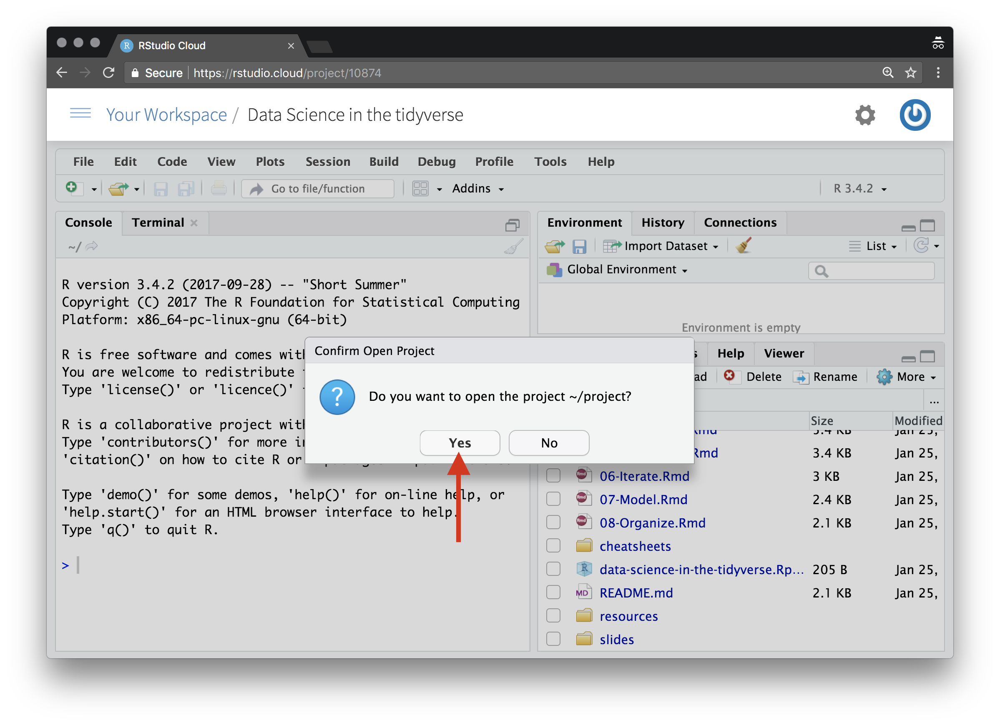
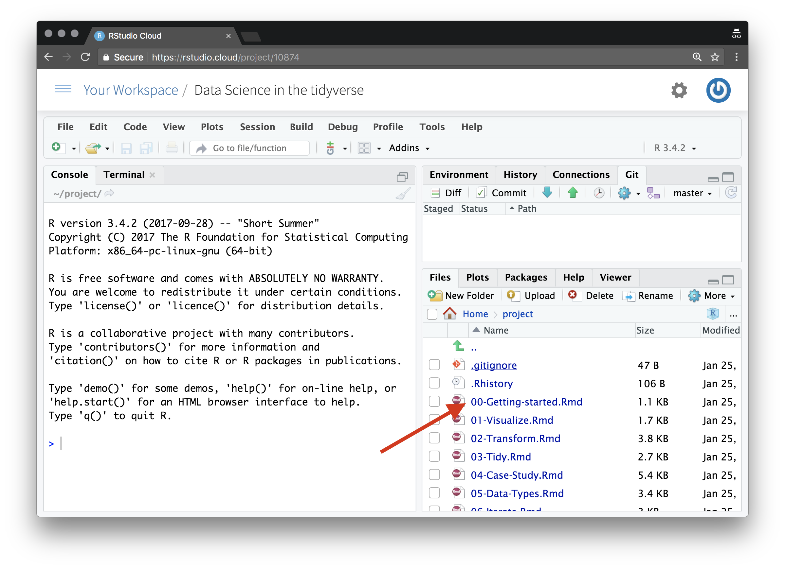
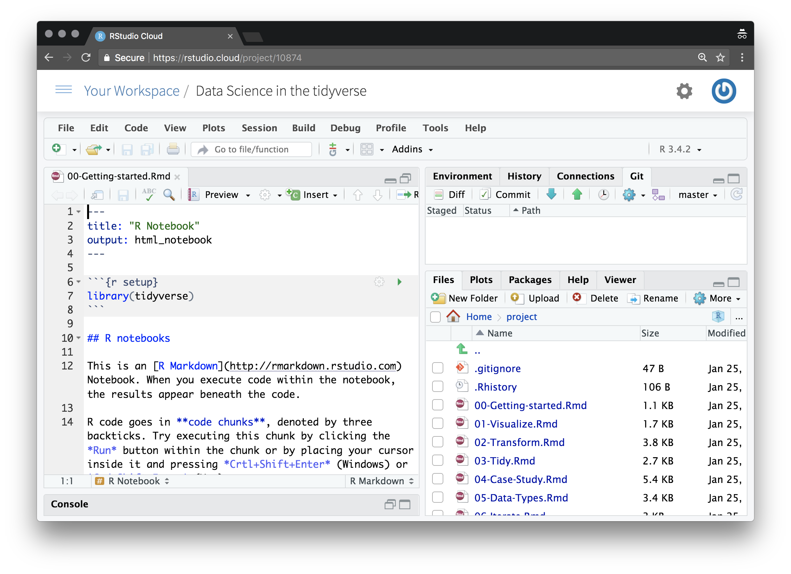

# Getting Set Up

During the workshop you'll do your work on [rstudio.cloud](https://rstudio.cloud/).  This provides an easy way for me to share all the materials with you, and removes the hassle of getting the right versions of R, RStudio or any packages.

## To get started:

To get set up follow these steps:

1.  Visit the project at https://rstudio.cloud/project/10871

2.  Log in using google, github, shinyapps.io or "Sign Up".

3.  The "Data Science in the tidyverse" project will open, but it's a *Temporary copy*.  Click *Save a copy*.

4. Now the "Data Science in the tidyverse" project will open again, but this time it is your own copy.  Navigate to the project folder:

5. Inside the project folder navigate to the "data-science-in-the-tidyverse.Rproj" file and click it.

6. You'll be asked if you want to open the project, hit Yes.

7. All going well, you should now see your project looking like this.  Now, open "00-Getting-started.Rmd"

8.  You're all set!  You might like to read through "00-Getting-started.Rmd" and do what it tells you.

## Once you are set up

You can access your copy of the project from *Your Workspace* on [rstudio.cloud](https://rstudio.cloud/).  